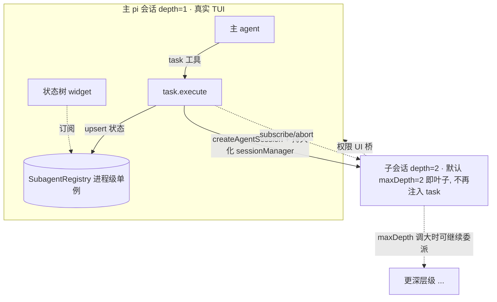

# pi-base Subagent 委派 — 高层技术方案

> 阶段：高层设计（方向 + 核心原理 + 主链路 + 模块职责 + 关键取舍）。详细实现、entry schema、坑位盘点、测试与上线见同目录 `design.md`。

## 第一手依据

- 现有实现：`src/agent-support.ts`（agent 切换）、`src/index-impl.ts`（工具注册/退役 task 清理）、`src/permission.ts`（权限）、`src/render.ts` + `src/bash-renderer-core.ts`（渲染）。
- pi 运行时（`~/proj/pi/packages/coding-agent/src`）：`core/sdk.ts` `createAgentSession`、`core/session-manager.ts`、`core/agent-session.ts`、`core/extensions/runner.ts`、`core/extensions/types.ts`。
- 参考实现：`~/proj/opencode`（task 工具模型）、`~/proj/pi-subagents`（in-process spawn + 扩展过滤）。

## 背景与目标

pi-base 现有 "agent" 是**单会话内的一次性重配置开关**（`/agent` 切换当前会话的 prompt/model/tools/skills，`agent-support.ts:264-303`），无法作为独立单元被委派。目标：在 pi-base 内新增 **OpenCode 式 subagent 委派能力**——主 pi 通过一个工具，把子任务委派给"现有 agents 里选出的"一个或多个 subagent，等待其在**独立子会话**中跑完并返回报告，支持按 session id resume，全程有清晰 UI。要求 KISS、复用 pi 既有能力，不引入跨进程/多终端复杂度。

## 需求点

| 序号 | 需求点 | 说明 |
| --- | --- | --- |
| R1 | 工具委派 | 主 agent 通过一个 LLM 可调用工具（`task`）发起委派 |
| R2 | 从现有 agents 选 | subagent 复用 `~/.pi/agent/agents/**/*.md`，无需新建体系 |
| R3 | per-agent 白名单 | agent frontmatter 新增 `subagents: [...]`，限定本 agent 可委派的下游 |
| R4 | 深度限制 | 全局 `subagent.maxDepth`（默认 2）：主=1→2，第 2 层不再注入 `task` |
| R5 | 单/多委派 | 支持委派给一个或多个 subagent（多个 = 一个 turn 内并行多次 `task` 调用） |
| R6 | 等待返回 | 前台同步等待子会话跑完（成功或失败） |
| R7 | 返回 session id + 报告 | 无论成败都返回子会话 session id；成功附最终报告 |
| R8 | resume | 传入 session id 续跑既有子会话；传不同 `subagent_type` 时按最新配置切换 model/prompt |
| R9 | 复用 pi session 存储 | subagent 会话 = 普通持久化 pi 会话，不自建存储 |
| R10 | UI-树 | 展示当前进程内所有 subagent 的实时运行状态树 |
| R11 | UI-调用滚动 | task 调用本身以"尾部向下滚动"容器展示执行过程，最终展示报告 |
| R12 | 权限 | 子任务需要权限时弹到主面板，并标明是哪个 agent 在申请 |
| R13 | 取消/异常 | 可取消 subagent；异常/崩溃后不产生僵尸进程/僵尸 UI |
| R14 | 并发上限 | `subagent.maxConcurrency`（默认 10）：单会话同时运行的 subagent 上限 |

## 范围、边界、约束

- 范围：pi-base 扩展内新增 subagent 模块 + 少量既有文件改动（agent 定义、工具注入、退役 task 清理）。
- 拓扑：**同进程内** `createAgentSession` 拉起子会话；不做跨进程/多终端（pi-interactive-subagents 那套）。
- 交互模式：本期只做**前台同步等待**；后台异步 + 完成回灌列为后续增强，不在本期。
- 不改动 pi 运行时源码；仅使用其对外 API。
- KISS：不引入新运行时依赖；最大化复用 pi-base 既有 agent/render/permission 逻辑。

## 完成标准

| 序号 | 对应需求 | 完成标准 |
| --- | --- | --- |
| C1 | R1,R2,R3 | 主 agent 能调用 `task`，`subagent_type` 仅限当前 agent `subagents` 白名单内的现有 agent |
| C2 | R4 | depth 达到 `maxDepth` 的会话不再注入 `task`，无法继续下钻 |
| C3 | R5,R6 | 一个 turn 内多次 `task` 并发执行并各自等待返回 |
| C4 | R7,R8,R9 | 返回真实 pi session id；成功带报告；用该 id 可 resume；子会话为磁盘上的普通 pi 会话 |
| C5 | R10,R11 | 主面板有实时状态树 widget；task 调用为尾部滚动容器、完成展示报告；agent 仅接收报告文本 |
| C6 | R12 | 子任务权限弹主面板且标注 agent；非交互模式下安全降级 |
| C7 | R13 | 父 turn 取消级联终止子会话；崩溃恢复无僵尸进程、无转圈僵尸、对话结构不破坏 |

## 方案概览

主 pi 会话（depth=1）通过 `task` 工具，用选定的 agent 定义在**同一 pi 进程内**经 `createAgentSession` 拉起一个**持久化子会话**（`parentSession` 指向父会话），前台等待其 `prompt()` 跑完，收集最后一条 assistant 文本作为报告返回。子会话本身也加载 pi-base，因此天然拥有 `task` 工具可继续向下委派，直到 `maxDepth` 截断。委派结构、实时状态由一个进程级注册表汇总并以树 widget 呈现；执行过程以尾部滚动容器流式展示，最终替换为报告文本。权限、取消、崩溃恢复复用并桥接 pi 既有机制。



> 默认 `maxDepth=2`：主会话可委派到 depth 2，depth 2 为叶子（不再注入 `task`）。调大 `maxDepth` 时按同样规则继续向下。

## 系统边界

| 角色 | 职责 |
| --- | --- |
| 主 pi 会话 | 唯一持有真实 TUI；渲染状态树 widget、承接权限弹窗；发起顶层委派 |
| `task` 工具 | 校验白名单/深度、拉起或 resume 子会话、订阅进度、收敛报告、级联取消 |
| 子会话（AgentSession） | 独立上下文运行 subagent；自身也可继续委派 |
| SubagentRegistry | 进程级单例，聚合所有层级 subagent 的实时状态，驱动 widget |
| 权限 UI 桥 | 把子会话交互（select/confirm/input/notify）转发到主面板并标注 agent |
| pi 运行时 | 提供 `createAgentSession`/`SessionManager`/`bindExtensions`/`subscribe`/`abort`/渲染原语 |

## 核心原理

1. **子会话 = 普通持久化 pi 会话（复用存储机制、隔离存储目录）。** `SessionManager.create(cwd, dir, { parentSession })`（`session-manager.ts:824-848`）落盘 jsonl，`parentSession` 记录父子链接；`dir` 用隔离目录 `subagent-sessions/`（见 `design.md` 6.1）避免污染 `/resume`。`buildSessionContext` 只回放会话**自身**的 entry（`session-manager.ts:325-432`），因此 `parentSession` 仅是元数据、**不会把父会话上下文注入子会话**——子 agent 从干净上下文起步。返回给上层的 `session_id` 即该子会话真实 id；resume 用 `SessionManager.open(path)` 载入后 `session.prompt()` 续跑。

2. **同进程 spawn，无孤儿进程。** `createAgentSession`（`sdk.ts:166`）在当前进程内构造会话，`bindExtensions()` 重新绑定扩展。子任务执行随主进程存亡，崩溃不留 orphan 进程（相对跨进程方案的关键优势）。

3. **复用 pi-base agent 装配（不重写 prompt）。** 在子会话创建时预写一条 `pi-base-agent-state` 自定义 entry（`{ name }`），子会话 `session_start` 由既有 `pickAgentFromEntries`/`applyAgent` 自动套用该 agent 的 prompt/model/tools/skills（`agent-support.ts:99-100,187-278`）。这样只有一条 agent 装配代码路径。

4. **深度随会话持久化。** 创建子会话时预写 `pi-base-subagent-depth`（`appendCustomEntry`，`session-manager.ts:1013`）。root 无此 entry → depth=1。`task` 工具是否注入由 `depth < maxDepth && 当前 agent.subagents 非空` 决定。深度随会话文件恢复，防递归爆炸与 A→B→A 循环。

5. **并行委派天然成立。** pi 工具执行默认 `parallel`（预检顺序化、执行并发，结果按源顺序回填；`extensions/types.ts:456`、`agent` README 工具执行说明）。`task` 标 `executionMode:"parallel"`，一个 turn 内多次 `task` 调用即并发多 subagent。

6. **实时态在内存、历史态在磁盘。** "谁在跑"只有运行进程知道（进程级 `SubagentRegistry`）；"跑过谁/树形结构"可由会话文件 `parentSession` 重建。**不把 running 态落盘再复原**，从根上杜绝僵尸树。

7. **UI 滚动是宿主能力。** 工具只产出内容：执行中经 `onUpdate` 吐"增长活动日志"，用 bash 同款尾部折叠（`slice(-collapsedLines)`，`bash-renderer-core.ts:69-91`）实现向下滚动；完成后内容切为报告。恢复时 `isStreamingCall` 因 `isPartial===false` 返回 false（`render.ts:247-258`），静态渲染、无转圈僵尸。

8. **权限经 UI 桥回主面板。** 子会话 `bindExtensions({ uiContext: 桥 })` 使其 `hasUI=true`（`runner.ts:400-410`），`permission.ts` 命中 `ask` 时调用的 `ctx.ui.select` 即桥 → 转发主面板并前置"哪个 subagent 申请"。**permission.ts 核心逻辑无需改造**。

## 核心数据结构与状态

```ts
// 进程级单例，聚合全树实时态
interface SubagentNode {
  sessionId: string;          // 子会话 pi id，也是返回上层的 session_id
  parentSessionId: string;    // 父会话 id（画树用）
  agentType: string;          // 选用的 agent 名
  description: string;        // 短描述（UI 展示）
  depth: number;
  status: "running" | "done" | "error" | "cancelled" | "interrupted";
  toolCount: number;          // 子会话已执行工具数
  startedAt: number; endedAt?: number;
}
```

会话内持久化的两条自定义 entry（不进 LLM 上下文）：

- `pi-base-agent-state`：`{ name }` —— 复用既有常量，子会话据此套用 agent。
- `pi-base-subagent-depth`：`{ depth }` —— 深度控制的持久载体。

状态流转：`running → done | error | cancelled`；崩溃遗留的悬空 task 调用在 resume 对账时补为 `interrupted`。

## 核心链路

### spawn（新建委派）

1. `task.execute` 校验 `subagent_type ∈ 当前 agent.subagents`，否则报错返回。
2. 读当前会话 depth entry → `parentDepth`（默认 1）；`childDepth = parentDepth + 1`。
3. `sm = SessionManager.create(cwd, defaultSessionDir, { parentSession: 父会话文件 })`。
4. 向 `sm` 预写 `pi-base-agent-state{name}` 与 `pi-base-subagent-depth{childDepth}`。
5. `createAgentSession({ sessionManager: sm, resourceLoader: 受控 loader, modelRegistry: ctx.modelRegistry, model, cwd, agentDir })` → `session.bindExtensions({ uiContext: 权限桥 })`。
6. `registry.upsert(running)`；`session.subscribe` 累加 toolCount / 推 `onUpdate` 活动日志；`forwardAbortSignal(session, ctx.signal)`。
7. `await session.prompt(prompt)`；收敛最后 assistant 文本为报告。
8. `registry.update(done|error)`；返回 `<task id state>...`。

### resume（续跑）

1. `task.execute` 带 `session_id`：由 id 解析出会话文件路径（`SessionManager.list` 匹配），若该 id 在 registry 中为 running 则拒绝（防并发重入）。
2. `sm = SessionManager.open(path)` → `createAgentSession({ sessionManager: sm, ... })` → `bindExtensions`。agent/depth 由会话内既有 entry 恢复。
3. `await session.prompt(prompt)` 续跑 → 返回同结构结果。

### cancel（取消）

- 父 turn 被取消 → `task.execute` 的 `ctx.signal` abort → `forwardAbortSignal` → `session.abort()`（`agent-session.ts:1424`）。每层都做同样绑定，取消**天然向下级联**。registry 置 `cancelled`，清理订阅与 widget 行。

### crash 恢复对账

- 主会话 `session_start`（恢复）扫描自身 `task` 调用：凡有 tool_use 无配对 tool_result 者，补一条 `interrupted` 结果 → 对话结构闭合、静态渲染为 `■ interrupted`。registry/widget 为纯内存态，重启即空，无僵尸。

## 模块职责

```
src/subagent/
  registry.ts     进程级 SubagentRegistry 单例（EventEmitter）：全树实时态
  runner.ts       spawn/resume 引擎：createAgentSession 封装、subscribe 收敛、forwardAbortSignal
  ui-bridge.ts    权限/交互 UI 桥：子 ctx.ui → 父 ctx.ui，标注 agent；非对话类 UI no-op
  task-tool.ts    task 工具：schema、execute(onUpdate 流式)、renderCall/renderResult、返回 XML
  widget/tree.ts  仅 depth==1 会话注册的状态树 widget（订阅 registry）
  depth.ts        会话 depth entry 读/写
  config.ts       subagent.maxDepth / maxConcurrency 读取（并入 pi-base 配置合并）
  reconcile.ts    resume 时悬空 task 调用对账为 interrupted
```

既有文件改动：`agent-support.ts`（解析 `subagents`、按 depth+白名单注入/撤除 `task`）、`index-impl.ts`（注册 `task`、修正退役 task 清理逻辑）。复用：agent catalog 加载、`buildAgentSystemPrompt`、`BASE_TOOL_GUIDE`、`render.ts`/`bash-renderer-core.ts`、`permission.ts`。

## 关键设计与取舍

| 决策点 | 选择 | 原因 / 代价 / 风险 |
| --- | --- | --- |
| 拓扑 | 同进程 `createAgentSession` | KISS、无孤儿进程、复用存储；代价：与主进程共享资源，隔离弱于跨进程 |
| agent 装配 | 复用 pi-base agent-support（预写 entry） | 单一代码路径、避免重写 prompt；代价：子会话需加载 pi-base，存在 reentrancy 需处理 |
| 子会话扩展集 | 受控 loader：默认仅 pi-base（+agent 声明扩展），排除 MCP/LSP | 避免每个 subagent 重启 MCP/LSP 的重开销；注意"被排除扩展的 factory 仍会跑一次，非沙箱" |
| 深度载体 | 持久化 session entry | resume 后可恢复；registry 仅作实时态 |
| 多委派 | 单目标工具 + 并行多次调用 | 契合 pi 并行工具执行，schema 最简 |
| 交互模式 | 仅前台同步 | KISS；后台异步/回灌留待后续 |
| 权限 | UI 桥转发 + 标题标注 | 不改 permission.ts；代价：跨会话并发弹窗需桥内串行 |
| 工具命名 | `task`（并修正退役清理） | 对齐 Claude Code/OpenCode 直觉；须处理与退役 task 清理的冲突 |
| session 存储位置 | 隔离到兄弟根目录 `subagent-sessions/` | 与默认 `sessions/` 完全隔离，不污染 `/resume`/自动续接；复用现有 cwd 编码约定 |

## 需求点 Check List

| 需求 | 高层实现方式 | 覆盖 |
| --- | --- | --- |
| R1 工具委派 | `task-tool.ts` 注册 LLM 工具 | ✅ |
| R2 现有 agents | 复用 agent catalog + `pi-base-agent-state` 装配 | ✅ |
| R3 白名单 | frontmatter `subagents` + execute 时校验 | ✅ |
| R4 深度 | depth entry + `depth<maxDepth` 注入 `task` | ✅ |
| R5/R6 单多+等待 | `executionMode:"parallel"` + `await prompt()` | ✅ |
| R7 id+报告 | 先建会话得 id，收敛最后 assistant 文本 | ✅ |
| R8 resume | `SessionManager.open` + `prompt()`；跨类型追加 `pi-base-agent-state` 切换最新配置 | ✅ |
| R9 复用存储 | 持久化 `SessionManager.create`（隔离目录），`parentSession` 链接 | ✅ |
| R10 树 UI | `SubagentRegistry` + `widget/tree.ts`（depth==1） | ✅ |
| R11 滚动 UI | `onUpdate` 增长日志 + 尾部折叠渲染，完成切报告 | ✅ |
| R12 权限 | `ui-bridge.ts` + `bindExtensions({uiContext})` | ✅ |
| R13 取消/异常 | `forwardAbortSignal` 级联 + 崩溃对账 + 纯内存实时态 | ✅ |
| R14 并发上限 | `task-tool` 按 `maxConcurrency` 计数校验，超限返回 error | ✅ |
